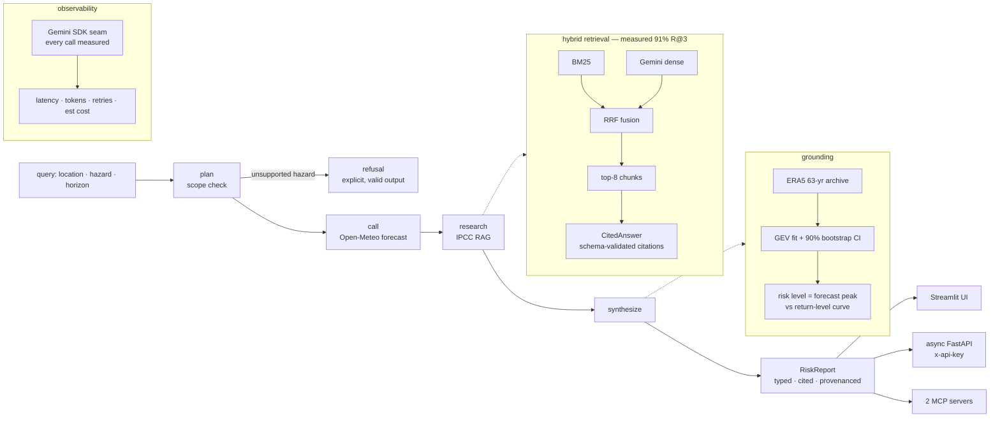

# Climate-Risk Analyst Agent

[](https://github.com/AswaniSahoo/climate-risk-agent/actions/workflows/ci.yml)

An open-source **AI agent** (not a chatbot) that turns live weather data and authoritative climate documents into a **grounded, cited, structured risk report** — with the **evaluation, guardrails, and observability** systems production AI actually needs.

> **The 30-second version:** LangGraph agent · frozen 45-question benchmark (refusal confusion matrix **34/11/0/0 — zero fabricated answers**, held through 3 system redesigns) · citations structurally validated (the LLM *cannot* cite what it didn't retrieve) · claim-level LLM-judge audit (93%) · code-level scope guard · GEV return levels **with bootstrap CIs** · every model call telemetried at the SDK seam (latency, tokens, **est. cost per report: ~$0.001**) · two-layer measured caching (repeat query **56 s → 0.8 s**) · async FastAPI + Streamlit + 2 MCP servers · Docker + CI · **174 tests green**. Every number reproducible from the frozen benchmark in this repo.

## Why an agent, not a chatbot

A chatbot predicts plausible text — ask it about flood risk and it invents a number. This agent **plans, fetches real data, and grounds every claim**, then returns a typed report it can back up (or refuses when a question is out of scope).


## The design in one idea

Trust here is **structural, not prompted**. Every guarantee lives in a validator, a guard, or a chokepoint — places an LLM cannot argue with:

| Guarantee | Enforced by |
|---|---|
| A citation must reference a retrieved chunk | Pydantic `model_validator` — fabrication is *unconstructable* |
| Out-of-scope hazards never reach the LLM | code-level scope guard, runs before any model call |
| A report asserts a risk XOR refuses | contract validator — the dishonest state can't exist |
| No model call escapes measurement | telemetry at the single SDK seam all traffic crosses |
| Numbers don't regress silently | frozen benchmark + evals as a release gate |

## Measurement: the moat

- **The benchmark came first.** 45 hand-verified questions authored *before* the retriever existed, every supporting quote machine-checked verbatim against the PDFs, the set frozen by content hash — with adversarial slices (duplicate-region traps, false premises, out-of-scope lures).
- **Every layer bought its way in with a delta on the same frozen questions:** naive chunks 76% → row-atomic table chunks 82% → hybrid BM25+dense RRF **91%** headline R@3 (dense *alone* underperforms at 71% — fusion is what wins); the trap slice went **0% → 100%**. Current caption-carry chunking trades R@3 to 88% (R@5/10 hold 94%) for a perfect end-to-end matrix — a documented, deliberate trade.
- **The end-to-end result: a perfect refusal confusion matrix** — 34 correct answers · 11 correct refusals · **0 false refusals · 0 false answers**, with the zero-confabulation cell held through a retriever swap, a context-size change, and a chunking redesign. Citation validity 94% · numeric provenance 85% · **claim-level LLM-judge support 93%** (claims audited against cited excerpts only; the remaining flags are the judge being *stricter than PDF linearization allows* — documented, not fought).

## Grounding: real data, honest statistics

- **ERA5 → GEV → return levels with uncertainty**: 60+ years of daily extremes per location; every 10/50/100-year level ships with a **90% parametric-bootstrap confidence band**; `record_max` sits beside the fitted levels so degenerate tails are visible at a glance, and a `representativeness` enum says how far to trust a reanalysis point value.
- **The risk verdict is location-relative**: severity = where the forecast peak sits on *that location's* return-level curve (a 46 °C day is normal in Rourkela and record-class in Berlin). Report confidence is composed from actual grounding, never a constant.
- **IPCC RAG with page-level citations**: AR6 WG1 SPM + Ch.11 + Ch.12 (439 pages), row-atomic chunking with table-caption carry for the regional assessment tables, hybrid retrieval, and citations that resolve to real PDF pages.

## Operations

- **Observability at the seam** — latency, real token counts, retries, cache hits, estimated cost for every model call; per-report rollups in the UI and API responses; `uv run python -m obs.report` aggregates across sessions. Measured: a fully-grounded report ≈ **$0.001**; a repeated one — content-keyed answer cache — **$0 and 0.8 s instead of 56 s**.
- **Three front doors**: an async FastAPI service (`POST /report` via `asyncio.to_thread`, `x-api-key` access control, `/metrics`), a Streamlit UI that renders only the report contract, and two stdio MCP servers (`weather-mcp`, `ipcc-rag-mcp`) for AI clients.
- **Docker + CI + release gate**: self-sufficient image (corpus baked at build; degrades loudly to BM25-only without a key), GitHub Actions on every push, and evals as a documented manual release gate — `false_answer > 0` blocks release ([DEPLOY.md](DEPLOY.md)).
- **174 tests, all green** — HTTP mocked throughout; security invariants (host pinning, boundary validation, secret-leak checks) pinned as tests.

## Architecture



Every arrow above is guarded by a validator or a test: the LLM cannot cite unretrieved chunks, a report cannot both assert and refuse, no model call escapes telemetry, and out-of-scope hazards never reach the LLM.

## Use it over MCP

The tools are exposed as two [MCP](https://modelcontextprotocol.io) servers, so any MCP client (Claude Desktop, Cursor, the MCP Inspector) can call them — no custom glue per app.

```bash
uv run mcp dev tools/weather_mcp.py   # forecast + hazard climatology
uv run mcp dev tools/ipcc_mcp.py      # IPCC search + cited answers
```

`get_forecast` exposed as an MCP tool — the input schema is auto-generated from the Python function's type hints:


Calling it live from the Inspector (real Open-Meteo data, fetched through MCP):


## Quickstart

```bash
uv sync                        # install dependencies
uv run pytest                  # run the test suite (174 green)
uv run python -m scripts.demo  # live end-to-end demo → prints a RiskReport
uv run streamlit run ui/app.py # the UI (localhost:8501)
uv run uvicorn api.app:app --port 8000   # the API (POST /report, /metrics; set API_KEY)
uv run python -m obs.report    # telemetry rollup: latency percentiles + est cost per op

# evals — run the numbers yourself
uv run python -m scripts.download_ipcc      # fetch the corpus (once)
uv run python -m evals.run_retrieval_eval   # recall@{3,5,10} + MRR per slice, Wilson CIs
uv run python -m evals.run_e2e_eval         # refusal matrix + citation/numeric checkers (needs Gemini auth)
EVAL_CLAIM_JUDGE=1 uv run python -m evals.run_e2e_eval  # + claim-level LLM-judge audit
uv run python -m evals.run_graph_eval       # the REAL agent path, live scenarios, contract checks

# or containerized (corpus bakes in at build; see DEPLOY.md for HF Spaces)
docker build -t climate-risk-agent . && docker run -p 7860:7860 climate-risk-agent
```

The gold set (`evals/gold_set.json`) was authored **before** retrieval existed and is frozen by content hash — editing a question breaks the suite until the freeze is deliberately renewed. Questions are never edited to make retrieval look better.

Example output (real Open-Meteo data + real IPCC citations from a live run):

```json
{
  "location": "Rourkela, India",
  "hazard": "extreme_precip",
  "risk_level": "moderate",
  "summary": "Peak daily rainfall of 46.2 mm over 7 days. ERA5 return levels (10yr=134.4, 50yr=187.3, 100yr=212.0). IPCC AR6: Extreme precipitation is projected to increase in South Asia [...] (high confidence).",
  "confidence": 0.6,
  "citations": [
    { "source": "IPCC_AR6_WGI_Chapter11.pdf", "locator": "p53" },
    { "source": "IPCC_AR6_WGI_Chapter11.pdf", "locator": "p54" }
  ],
  "provenance": [{ "source": "Open-Meteo", "retrieved_at": "..." }]
}
```

Every `locator` is a real PDF page, and the answerer structurally cannot cite a chunk it didn't retrieve.

## Tech stack

Python · [uv](https://docs.astral.sh/uv/) · Pydantic v2 · LangGraph · Gemini (google-genai SDK; AI Studio or Vertex) · numpy/scipy (GEV) · FastAPI (async) · httpx · MCP Python SDK · Streamlit · pytest · Docker · GitHub Actions.

## Data & attribution

- **Forecasts & climatology:** [Open-Meteo](https://open-meteo.com/) (forecast + ERA5 archive APIs), licensed **CC-BY 4.0**.
- **Reanalysis:** ERA5, Copernicus Climate Change Service (C3S) / ECMWF.
- **Climate assessment:** IPCC AR6 WG1 (SPM + Chapters 11 & 12), © IPCC — reused for research under IPCC's terms.

Hazard return levels are point-interpolated ERA5 reanalysis (~25 km), not station observations — see [LIMITATIONS.md](LIMITATIONS.md) and the `representativeness` field on every `HazardStat`.

## Security, limitations, roadmap

- [SECURITY.md](SECURITY.md) — the threat model; every control that matters is pinned by a test.
- [LIMITATIONS.md](LIMITATIONS.md) — what these numbers do and don't mean. Read it before trusting a return level.
- [ROADMAP.md](ROADMAP.md) — what shipped (with numbers) and what's next.
