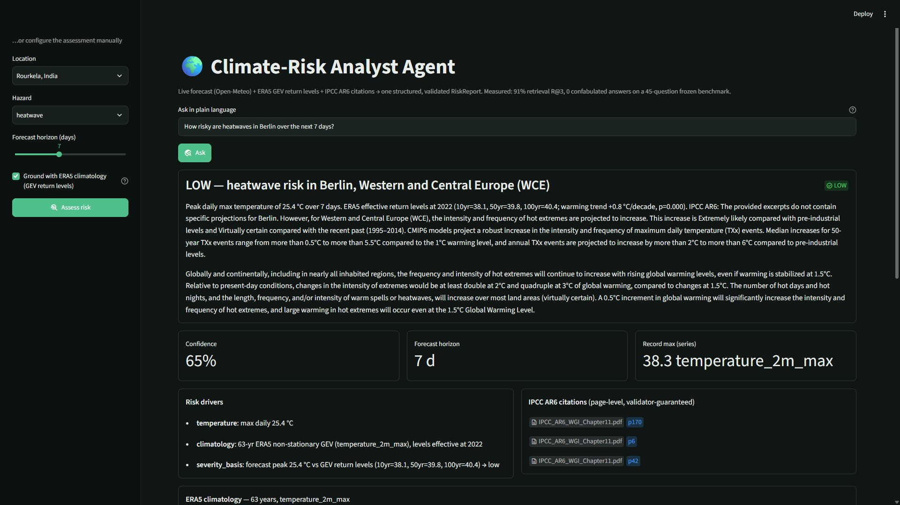
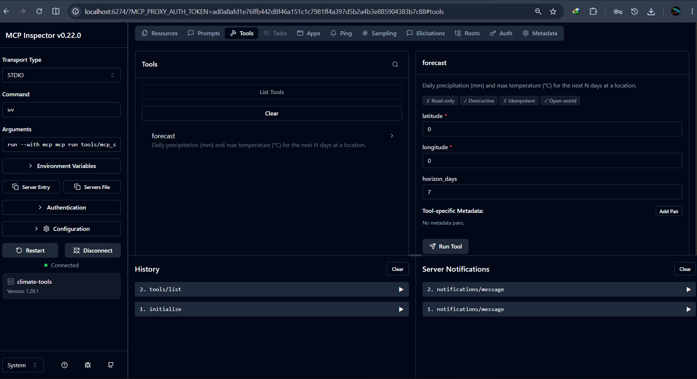
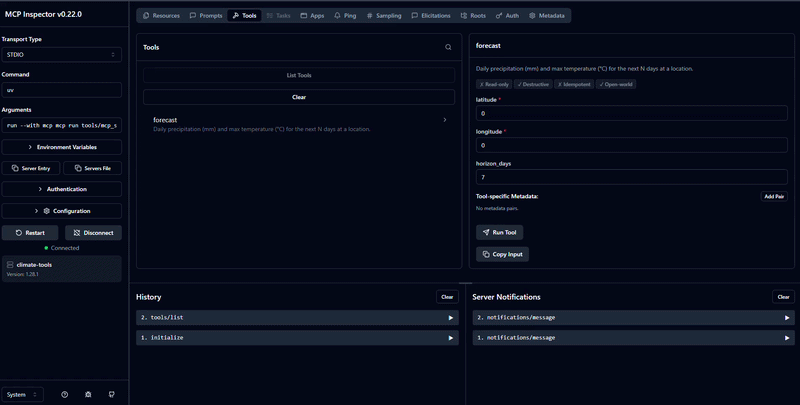
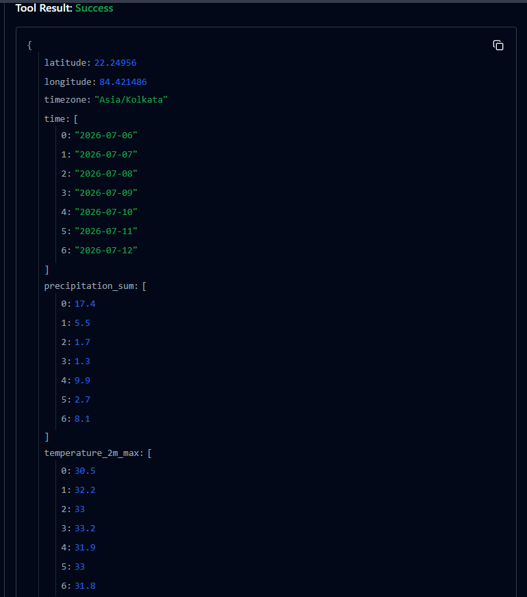

# Climate-Risk Analyst Agent

[](https://github.com/AswaniSahoo/climate-risk-agent/actions/workflows/ci.yml)

An open-source **agent** (not a chatbot) that turns live weather data and authoritative climate documents into a **grounded, cited, structured risk report** for a location, hazard, and time horizon.

> **Status: the moat is measurable.** ERA5 extreme-value statistics with full provenance, an IPCC RAG with page-level citations, and a **frozen, hash-pinned eval set with published recall numbers** — hybrid (BM25 + dense + RRF) headline recall@3 **91%** (95% CI 77–97), up from 76% naive baseline, with every failure slice printed too. Built in public.

## Why an agent, not a chatbot

A chatbot predicts plausible text — ask it about flood risk and it invents a number. This agent **plans, fetches real data, and grounds every claim**, then returns a typed report it can back up (or refuses when a question is out of scope).



## What works today

- **Typed output contract** — a Pydantic `RiskReport` (risk level, drivers, citations, data provenance, confidence, refusal). Bad output can't be constructed: the level is a 4-value enum, confidence is bounded `[0,1]`, and a report must either assert a risk *or* refuse — never both.
- **ERA5 hazard statistics with honest provenance** — 60+ years of daily extremes → GEV fit → 10/50/100-year return levels. Every `HazardStat` states its statistic definition, resolution, `record_max` beside the fitted levels (degenerate tails visible at a glance), and a `representativeness` enum. Live example: Rourkela's 100-year daily-max temperature fits at 46.0 °C against a 46.1 °C record.
- **IPCC RAG with page-level citations** — AR6 WG1 SPM + Ch.11 + Ch.12 (439 pages), row-atomic chunking for regional assessment tables, zero-dependency BM25 (+ Gemini dense / RRF hybrid), and an LLM answerer whose **citations are structurally validated**: a citation that doesn't reference a retrieved chunk cannot be constructed.
- **A frozen benchmark with published numbers** — 45 hand-verified questions; every supporting quote is machine-checked verbatim against the PDFs and the set is frozen by content hash. Recall@k with Wilson CIs per slice, including adversarial slices. The measured progression — naive chunks 76% → row-atomic table chunks 82% → BM25+dense RRF hybrid **91%** headline R@3; the duplicate-region trap slice went **0% → 100%** — is the design philosophy: every layer earned its place with a delta on the same frozen questions (dense alone actually *underperforms* BM25 at 71%; the fusion is what wins). The current caption-carry chunking trades R@3 to 88% (R@5/10 hold at 94%) for a perfect end-to-end matrix — a documented, deliberate trade: production answers from the top-8, so what matters is behavior, and behavior only improved.
- **Deterministic scope guard** — questions about unsupported hazards (drought, tropical cyclones, coastal flooding, wildfire) are refused in code, before the LLM, so the guard cannot be prompt-injected away.
- **A perfect confusion matrix, earned in three measured steps** — the end-to-end eval over all 45 frozen questions scores refusal behavior as a 4-cell matrix. Current: **34 correct answers, 11 correct refusals, 0 false refusals, 0 false answers.** The zero-confabulation cell held through a retriever swap, a context-size change, and a chunking redesign; the last false refusal died when table captions (the only place the 1.5/2/4 °C column labels live) were carried onto every row chunk. Citation validity 94%, numeric provenance 85%, **claim-level LLM-judge support 93%** (claims audited against cited excerpts only — the remaining flags are the judge being stricter than PDF linearization allows), and 3 of 4 premise-injection refusals cite the page that refutes the false premise.
- **Statistics with uncertainty** — every GEV return level ships with a 90% parametric-bootstrap confidence band; the risk verdict itself comes from the forecast peak's position on the location's return-level curve (location-relative severity), and report confidence is composed from actual grounding, not a constant.
- **Two MCP servers** — `weather-mcp` (forecast + hazard climatology) and `ipcc-rag-mcp` (search + cited answers), stdio-only, narrow and typed.
- **Real citations in the report** — a `research` graph node retrieves top-8 IPCC chunks and gets a schema-validated cited answer; the final `RiskReport.citations` are page-level (`Chapter11.pdf, p124`), deduped, and can only reference actually-retrieved chunks. Offline/no-LLM degrades loudly to a citation-less report — never silently, never invented.
- **Streamlit UI + Docker + CI** — one-page UI over the agent contract, a self-sufficient Docker image (corpus baked in at build; runs BM25-only without a key, hybrid with one), GitHub Actions on every push. Evals are a documented **manual release gate** (`false_answer > 0` blocks release) — see [DEPLOY.md](DEPLOY.md).
- **128 tests, all green** — HTTP mocked throughout; security invariants (host pinning, boundary validation, secret-leak checks) are pinned as tests.

## Architecture

```
query (location, hazard, horizon)
        │
        ▼
   LangGraph state machine
   plan ──▶ call ──▶ research ──▶ synthesize ──▶ RiskReport (typed, cited, provenanced)
     │      forecast   IPCC RAG      forecast + ERA5 GEV + cited IPCC answer
     │      (live)     (hybrid top-8 → validated CitedAnswer)
     │
     └─(unsupported hazard)─▶ refusal (explicit, valid output)
```

## Use it over MCP

The tools are exposed as two [MCP](https://modelcontextprotocol.io) servers, so any MCP client (Claude Desktop, Cursor, the MCP Inspector) can call them — no custom glue per app.

```bash
uv run mcp dev tools/weather_mcp.py   # forecast + hazard climatology
uv run mcp dev tools/ipcc_mcp.py      # IPCC search + cited answers
```

`get_forecast` exposed as an MCP tool — the input schema is auto-generated from the Python function's type hints:



Calling it live from the Inspector (real Open-Meteo data, fetched through MCP):





## Quickstart

```bash
uv sync                        # install dependencies
uv run pytest                  # run the test suite (128 green)
uv run python -m scripts.demo  # live end-to-end demo → prints a RiskReport
uv run streamlit run ui/app.py # the UI (localhost:8501)

# evals — run the numbers yourself
uv run python -m scripts.download_ipcc      # fetch the corpus (once)
uv run python -m evals.run_retrieval_eval   # recall@{3,5,10} + MRR per slice, Wilson CIs
uv run python -m evals.run_e2e_eval         # refusal matrix + citation/numeric checkers (needs Gemini auth)
EVAL_CLAIM_JUDGE=1 uv run python -m evals.run_e2e_eval  # + claim-level LLM-judge audit
uv run python -m evals.run_graph_eval       # the REAL agent path, live scenarios, contract checks

# or containerized (corpus bakes in at build; see DEPLOY.md for HF Spaces)
docker build -t climate-risk-agent . && docker run -p 7860:7860 climate-risk-agent
```

The gold set (`evals/gold_set.json`) was authored **before** retrieval existed and is frozen by content hash — editing a question breaks the suite until the freeze is deliberately renewed. Questions are never edited to make retrieval look better.

Example output (real Open-Meteo data + real IPCC citations from a live run):

```json
{
  "location": "Rourkela, India",
  "hazard": "extreme_precip",
  "risk_level": "moderate",
  "summary": "Peak daily rainfall of 46.2 mm over 7 days. ERA5 return levels (10yr=134.4, 50yr=187.3, 100yr=212.0). IPCC AR6: Extreme precipitation is projected to increase in South Asia [...] (high confidence).",
  "confidence": 0.6,
  "citations": [
    { "source": "IPCC_AR6_WGI_Chapter11.pdf", "locator": "p53" },
    { "source": "IPCC_AR6_WGI_Chapter11.pdf", "locator": "p54" }
  ],
  "provenance": [{ "source": "Open-Meteo", "retrieved_at": "..." }]
}
```

Every `locator` is a real PDF page, and the answerer structurally cannot cite a chunk it didn't retrieve.

## Tech stack

Python · [uv](https://docs.astral.sh/uv/) · Pydantic v2 · LangGraph · Gemini (google-genai SDK; AI Studio or Vertex) · numpy/scipy (GEV) · httpx · MCP Python SDK · Streamlit · pytest · Docker · GitHub Actions.

## Data & attribution

- **Forecasts & climatology:** [Open-Meteo](https://open-meteo.com/) (forecast + ERA5 archive APIs), licensed **CC-BY 4.0**.
- **Reanalysis:** ERA5, Copernicus Climate Change Service (C3S) / ECMWF.
- **Climate assessment:** IPCC AR6 WG1 (SPM + Chapters 11 & 12), © IPCC — reused for research under IPCC's terms.

Hazard return levels are point-interpolated ERA5 reanalysis (~25 km), not station observations — see [LIMITATIONS.md](LIMITATIONS.md) and the `representativeness` field on every `HazardStat`.

## Roadmap

- [x] IPCC AR6 RAG with page-level citations
- [x] ERA5 hazard statistics (return periods via extreme-value analysis) with provenance
- [x] Eval harness with numbers (retrieval recall@k + adversarial slices; e2e citation/refusal metrics)
- [x] MCP servers (weather-mcp + ipcc-rag-mcp), demoed in the MCP Inspector
- [x] Hybrid dense+RRF ablation published (bm25 82% / dense 71% / hybrid 91% headline R@3)
- [x] RAG citations wired into the `RiskReport` agent path (`research` graph node)
- [x] Streamlit UI, Docker image, CI; evals as a documented release gate
- [x] Risk verdict from GEV return-level position; composed confidence; bootstrap CIs on return levels
- [x] Claim-level LLM-judge eval + graph-path (real agent) eval
- [ ] Deployed demo on Hugging Face Spaces
- [ ] Table-caption-aware chunking (kills the last false refusal AND the judge's column-label flags)
- [ ] Eval v2: 150+ questions with dev/test split · non-stationary GEV · observability + cost metering

## Security & limitations

- [SECURITY.md](SECURITY.md) — the threat model; every control that matters is pinned by a test.
- [LIMITATIONS.md](LIMITATIONS.md) — what these numbers do and don't mean. Read it before trusting a return level.
