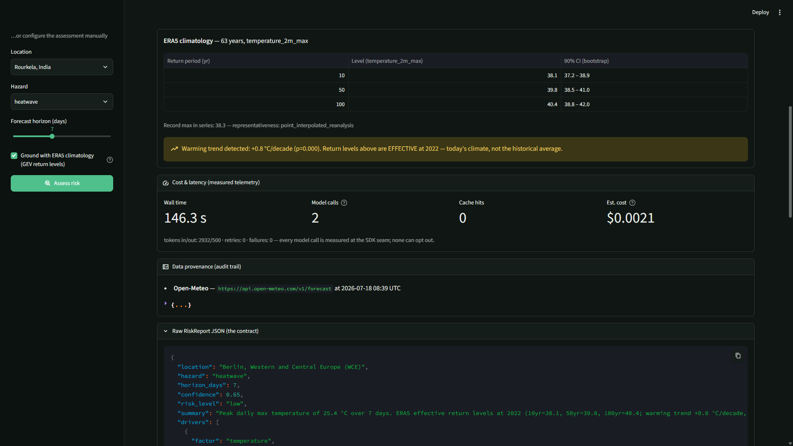
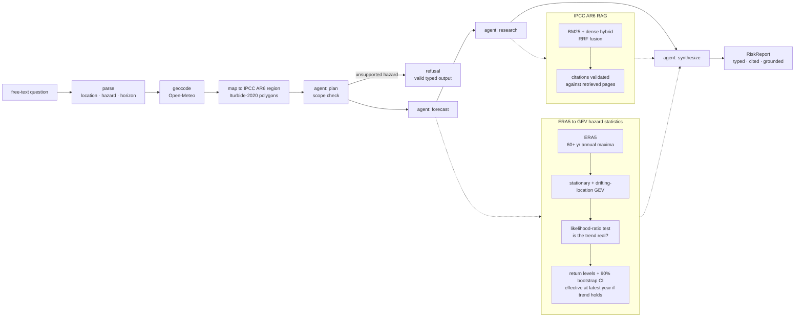

# Climate-Risk Analyst Agent

[](https://github.com/AswaniSahoo/climate-risk-agent/actions/workflows/ci.yml)


**Live demo:** https://climate-risk-agent-714882950125.us-central1.run.app/ (a public [Google Cloud Run](https://cloud.google.com/run) deployment).

This is an agent, not a chatbot. Ask a plain-language question, for example *"How risky are heatwaves in Tokyo over the next 5 days?"*, and it returns a typed, cited risk report built from real forecast data and IPCC climate science. When a question falls outside what it can actually check, it refuses instead of guessing.


## The measurement moat

- **ERA5 GEV hazard statistics.** Every hazard number comes from a Generalized Extreme Value distribution fit to 60+ years of ERA5 annual maxima at the query location. Risk severity is where the forecast peak lands on that location's own return-level curve, not a fixed threshold, and every return level ships with a 90% bootstrap confidence interval.
- **Non-stationary GEV.** Alongside the stationary fit, a drifting-location GEV checks whether the climate at that location is actually warming, using a likelihood-ratio test to decide. When the trend is real, return levels are reported "effective" at the latest year instead of averaged across six decades. Berlin comes back at +0.76°C per decade (p < 0.0001) with effective levels; Delhi comes back stationary (p = 0.56), which agrees with the published literature on aerosol masking suppressing South Asian heat trends.
- **IPCC AR6 RAG with citations that have to hold up.** Every citation is checked structurally against the pages actually retrieved for that question. If the model can't point to a real retrieved page, it refuses rather than cite one anyway.

The same report, scrolled down: the ERA5 return-level table with bootstrap confidence intervals, the warming-trend banner, and the measured cost and latency for that run.



## How it works

A free-text question moves through parsing, geocoding, and IPCC AR6 region mapping before it reaches the agent. From there a four-node LangGraph agent (plan, forecast, research, synthesize) either produces a typed `RiskReport` or refuses.



## Evaluation

- **Dev set:** 45 questions, used to steer development choices like chunking and retrieval configuration.
- **Test set:** 105 new questions, written after the dev set existed, never used to tune anything, frozen by SHA-256 so neither set can quietly change.

Held-out results (second exposure, on the exact configuration deployed):

- Retrieval: R@3 87%, R@5 91%, R@10 96% on answerable questions.
- Zero false answers across the full held-out refusal matrix. No confabulation.
- Citation validity: 96%. Numeric provenance: 88%.
- Measured cost about $0.003 per question, p50 latency 3.9 s.

Every eval artifact records the model that produced it, because a model swap is
invisible to a test suite. When the answering model was changed without
re-running these evals, the benchmark caught a usefulness regression that 240
passing tests did not: see [adr/0001-answering-model-selection.md](adr/0001-answering-model-selection.md).

Refusals are scored on a 4-cell confusion matrix (correct answer, correct refusal, false refusal, false answer). One false answer on that matrix blocks release.

## Operations

- Structured logging and per-request telemetry measured at the single SDK seam every model call passes through: latency, tokens, retries, and cost. Measured on the held-out run: about $0.003 per question, p50 3.9 s. Reasoning tokens are counted as billed output, and a model with no price entry reports its cost as unknown rather than as zero.
- Async FastAPI service (`POST /report`) with per-request API-key access control and a `/metrics` endpoint.
- Two MCP servers (weather, IPCC RAG) exposing the same tools over the Model Context Protocol.
- Disk-backed answer cache for repeat queries.
- Docker image, plus CI running ruff, mypy, and pytest. 240 tests green.

## Run it

```bash
uv sync
uv run streamlit run ui/app.py
```

With Docker:

```bash
docker build -t climate-risk-agent .
docker run -p 7860:7860 -e GEMINI_API_KEY=... climate-risk-agent
```

The [live demo](https://climate-risk-agent-714882950125.us-central1.run.app/) runs on Google Cloud Run. For deployment (Cloud Run, or local Docker and other hosts), see [DEPLOY.md](DEPLOY.md).

## Tech stack

Python, LangGraph, Google Gemini 2.5 Flash (generation) + gemini-embedding-2 (dense) on Vertex AI (global endpoint), BM25 + dense hybrid retrieval (RRF fusion), Pydantic, FastAPI, Streamlit, MCP Python SDK, scipy, Docker, GitHub Actions.

## Limitations

- ERA5 is gridded reanalysis, not station observations. Hazard stats describe an interpolated grid cell near the query location, not a measurement taken there.
- Scope is heat, extreme precipitation, and wind. Anything else should get a refusal, not an answer.
- The scope guard that keeps out-of-scope hazards away from the LLM is lexical (keyword-based). A paraphrase that avoids the known vocabulary could slip past it.

Data: forecasts and ERA5 climatology from [Open-Meteo](https://open-meteo.com/) (CC-BY 4.0); climate assessment from IPCC AR6 WG1, reused for research under IPCC's terms.

See [LIMITATIONS.md](LIMITATIONS.md) for the full list and [SECURITY.md](SECURITY.md) for the threat model. Shipped features and what's next: [ROADMAP.md](ROADMAP.md).
