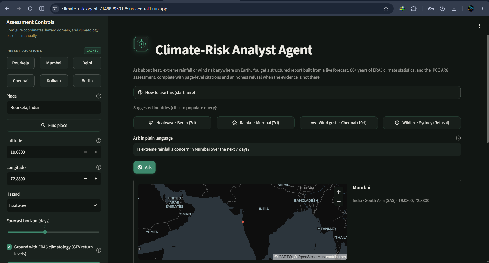
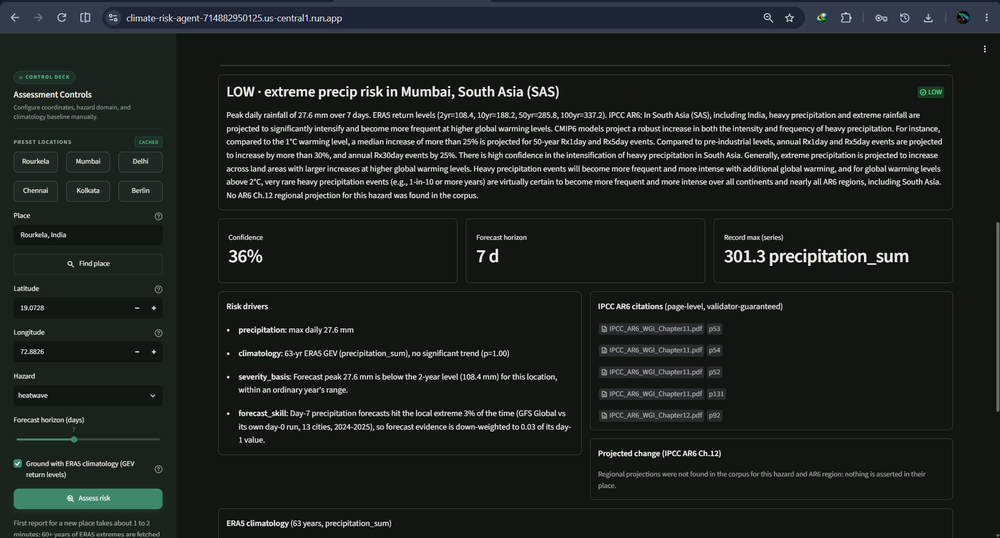
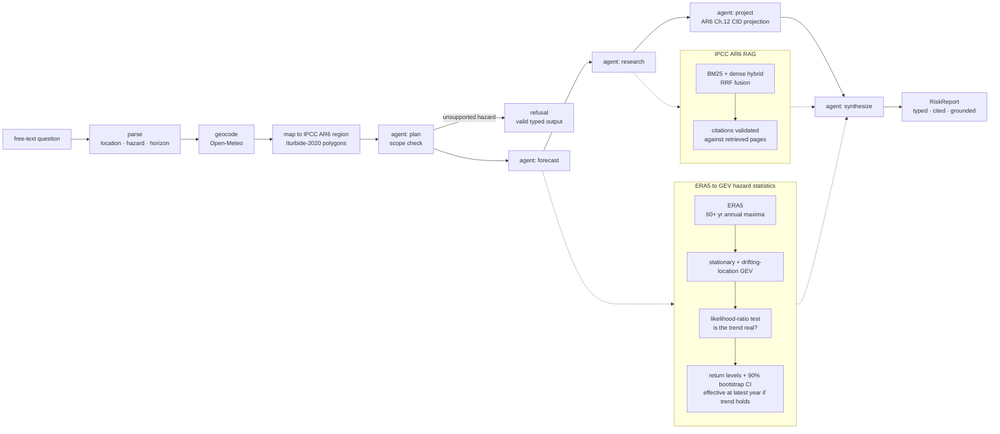
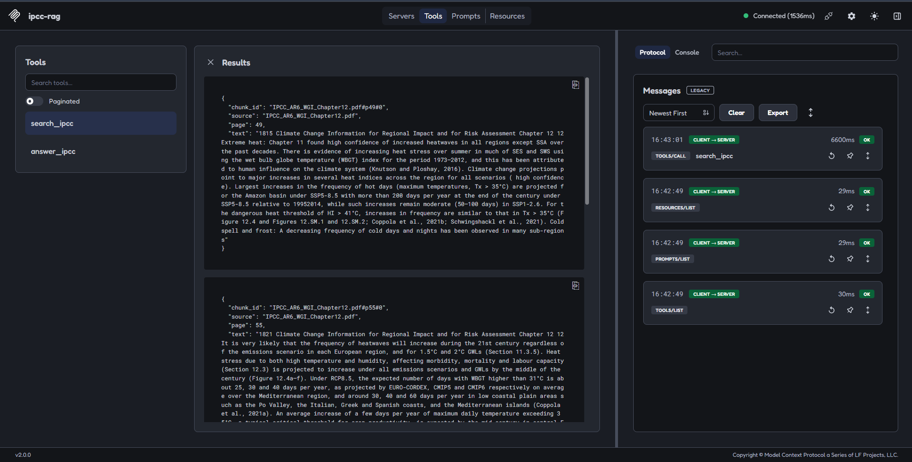
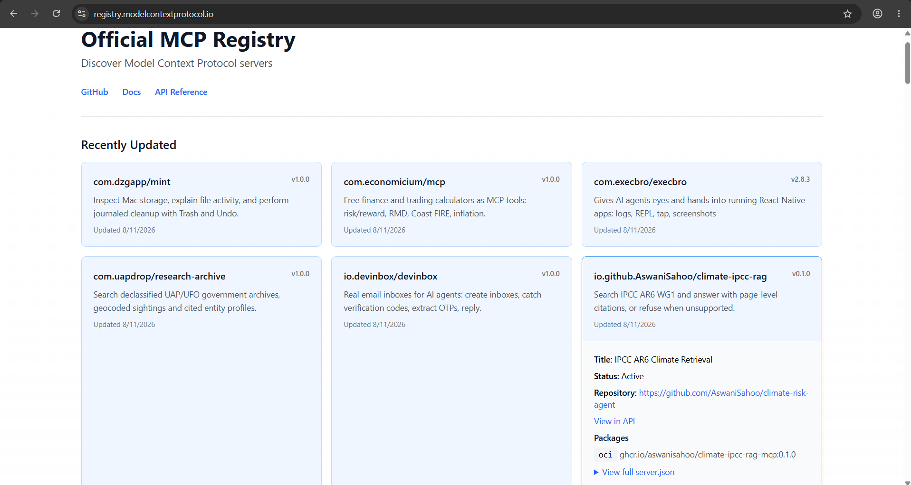

# Climate-Risk Analyst Agent

[](https://github.com/AswaniSahoo/climate-risk-agent/actions/workflows/ci.yml)


**Live demo:** https://climate-risk-agent-714882950125.us-central1.run.app/ (a public [Google Cloud Run](https://cloud.google.com/run) deployment).

This is an agent, not a chatbot. Ask a plain-language question, for example *"How risky are heatwaves in Tokyo over the next 5 days?"*, and it returns a typed, cited risk report built from real forecast data and IPCC climate science. When a question falls outside what it can actually check, it refuses instead of guessing.



## The measurement moat

- **ERA5 GEV hazard statistics.** Every hazard number comes from a Generalized Extreme Value distribution fit to 60+ years of ERA5 annual maxima at the query location. Every return level ships with a 90% bootstrap confidence interval.
- **Risk levels are local rarity, not a fixed threshold.** The band is the return period of the forecast peak on that location's own curve: below the 2-year level is low, 2 to 10 years moderate, 10 to 50 high, at or above 50 severe. The same 46 °C peak can therefore band low where an ordinary year already reaches it and severe where it is unprecedented, off the same code. Each report carries the sentence the band was decided on, naming the bracketing levels and the estimated return period. A location with no fitted climatology falls back to absolute cutoffs and says so in the report rather than passing them off as local.
- **Non-stationary GEV.** Alongside the stationary fit, a drifting-location GEV checks whether the climate at that location is actually warming, using a likelihood-ratio test to decide. When the trend is real, return levels are reported "effective" at the latest year instead of averaged across six decades. Berlin comes back at +0.76°C per decade (p < 0.0001) with effective levels; Delhi comes back stationary (p = 0.56), which agrees with the published literature on aerosol masking suppressing South Asian heat trends.
- **IPCC AR6 RAG with citations that have to hold up.** Every citation is checked structurally against the pages actually retrieved for that question. If the model can't point to a real retrieved page, it refuses rather than cite one anyway.
- **Projected change, quoted rather than generated.** Alongside the forecast, each report carries the AR6 WG1 Chapter 12 climatic impact-driver projection for the AR6 reference region containing the point: one verbatim Ch.12 sentence, its direction, the IPCC's own calibrated confidence phrase, and the warming level or period it names, all extracted by regex from retrieved chunks with no model in the loop. When the chapter assesses no such change for that region and hazard, the section is absent and the report says regional projections were not found in the corpus.

The same report, scrolled down: the ERA5 return-level table with bootstrap confidence intervals, the warming-trend banner, and the measured cost and latency for that run.



### Forecast skill

Every hazard number rests on a forecast, and a peak predicted six days out is not the same claim as one predicted tomorrow. That gap is measured rather than assumed. `scripts/measure_forecast_skill.py` reads Open-Meteo's [Previous Model Runs API](https://open-meteo.com/en/docs/previous-runs-api), which archives what the model had predicted for each hour 1 to 7 days before it happened, and scores every lead time against the model's own day-0 run over 2024-01-01 to 2025-12-31 at 13 cities on six continents, about 9,200 city-days per lead day.

| Hazard | MAE, day 1 | MAE, day 7 | Extreme days caught, day 1 → day 7 |
| --- | --- | --- | --- |
| Daily max temperature | 0.70 °C | 1.93 °C | 85% → 47% |
| Daily precipitation total | 2.03 mm | 3.03 mm | 53% → 3% |
| Daily max wind | 2.16 km/h | 4.68 km/h | 71% → 29% |
| Daily max gust | 3.47 km/h | 8.26 km/h | 69% → 34% |

"Extreme days caught" is how often a day above that location's own 95th percentile was also forecast above it. The frozen numbers sit in `tools/forecast_skill_table.json` next to their provenance, and `tools.forecast_skill.skill_for(hazard, horizon_days)` reads them, clamping horizons past day 7, where the archive stops, and flagging them as extrapolated.

The report spends those numbers rather than displaying them. Confidence is `min(0.75, 0.3 * w + climatology bonus + 0.1 if IPCC-cited)`, where `w = min(hit rate over lead days 1..L) / hit rate at day 1` is the share of day-1 extreme detection still standing at the report's lead day `L`: a day-1 heat report keeps the full 0.3 forecast term it always had, a day-7 one keeps 0.56 of it, and a horizon past day 7 reuses the day-7 figure because skill does not improve with lead time. Every report then carries a `forecast_skill` driver naming the number that did it, in the form "Day-7 temperature forecasts hit the local extreme 47% of the time (GFS Global vs its own day-0 run, 13 cities, 2024-2025), so forecast evidence is down-weighted to 0.56 of its day-1 value." The running minimum in `w` is deliberate: precipitation detection measures 1.7% at day 6 and 3.5% at day 7, which is sampling noise on ~458 extreme days rather than a forecast improving with lead time, and taking the minimum is what makes confidence monotone, so a longer horizon is never reported as surer.

Three caveats travel with these numbers. The reference series is the model's own latest run rather than station observations, so they are run-to-run consistency errors and a floor on true forecast error. The model is pinned to GFS Global because Open-Meteo's default `best_match` splices different models across lead offsets and fabricates biases that read like skill: at Delhi it placed the day-1 wind forecast 5.3 km/h off while the day-7 forecast landed within 0.1 km/h. And GFS drops from hourly to 3-hourly output past forecast hour 120, which flattens daily rainfall totals, so the collapse in precipitation detection after day 4 is partly output resolution and not only the forecast missing the storm.

## How it works

A free-text question moves through parsing, geocoding, and IPCC AR6 region mapping before it reaches the agent. From there a five-node LangGraph agent (plan, forecast, research, project, synthesize) either produces a typed `RiskReport` or refuses.


```mermaid
flowchart LR
    Q[free-text question] --> PARSE[parse<br/>location · hazard · horizon]
    PARSE --> GEO[geocode<br/>Open-Meteo]
    GEO --> REGION[map to IPCC AR6 region<br/>Iturbide-2020 polygons]
    REGION --> PLAN[agent: plan<br/>scope check]
    PLAN -->|unsupported hazard| REFUSE[refusal<br/>valid typed output]
    PLAN --> FORECAST[agent: forecast]
    FORECAST --> RESEARCH[agent: research]
    RESEARCH --> PROJECT[agent: project<br/>AR6 Ch.12 CID projection]
    PROJECT --> SYNTH[agent: synthesize]
    SYNTH --> REPORT[RiskReport<br/>typed · cited · grounded]

    subgraph HAZARD [ERA5 to GEV hazard statistics]
        ERA5[ERA5<br/>60+ yr annual maxima] --> GEV[stationary + drifting-location GEV]
        GEV --> LRT[likelihood-ratio test<br/>is the trend real?]
        LRT --> LEVELS[return levels + 90% bootstrap CI<br/>effective at latest year if trend holds]
    end
    FORECAST -.-> HAZARD
    HAZARD -.-> SYNTH

    subgraph RAG [IPCC AR6 RAG]
        HYBRID[BM25 + dense hybrid<br/>RRF fusion] --> VALID[citations validated<br/>against retrieved pages]
    end
    RESEARCH -.-> RAG
    RAG -.-> SYNTH
```

## Evaluation

- **Dev set:** 60 questions, used to steer development choices like chunking and retrieval configuration. The 15 `cid-table` questions arrived with the Chapter 12 projection layer, and the set was re-frozen under a new SHA-256.
- **Test set:** 105 new questions, written after the dev set existed, never used to tune anything, frozen by SHA-256 so neither set can quietly change.

Dev-set retrieval, all 60 questions (49 answerable), measured 2026-09-02:

| retriever | R@3 | R@5 | R@10 | MRR |
| --- | --- | --- | --- | --- |
| BM25 only | 76% | 82% | 88% | 0.68 |
| dense only | 61% | 69% | 86% | 0.59 |
| hybrid (shipped) | 82% | 90% | 94% | 0.70 |

Per slice, hybrid R@3: single-page 92% (n=12), regional table 90% (n=10), multi-page 80% (n=10), premise injection 75% (n=4), `cid-table` 67% (n=15). `cid-table` is the weakest slice and is why the dev-set headline is 82% across all 60 questions where it was 91% across the original 45.

Dev-set end-to-end, all 60 questions (gemini-2.5-flash, top_k 8, scope guard stage 2 off, measured 2026-09-02):

| cell | count |
| --- | --- |
| correct answer | 48 |
| correct refusal | 11 |
| false refusal | 1 |
| **false answer** | **0** |

Citation validity 41/48 (85%). Numeric provenance 42/48 (88%). Grounded refusals 3/4. Cost $0.20 for the run, about $0.0034 per question, p50 latency 5.5 s across 55 model calls with 6 retried rate limits and no failures.

Held-out results (second exposure, on the exact configuration deployed):

- Retrieval: R@3 87%, R@5 91%, R@10 96% on answerable questions.
- Zero false answers across the full held-out refusal matrix. No confabulation.
- Citation validity: 96%. Numeric provenance: 88%.
- Measured cost about $0.003 per question, p50 latency 3.9 s.

Every eval artifact records the model that produced it, because a model swap is
invisible to a test suite. When the answering model was changed without
re-running these evals, the benchmark caught a usefulness regression that 240
passing tests did not: see [adr/0001-answering-model-selection.md](adr/0001-answering-model-selection.md).

Refusals are scored on a 4-cell confusion matrix (correct answer, correct refusal, false refusal, false answer). One false answer on that matrix blocks release.

**What runs when:** every push and PR runs ruff, mypy and pytest; both evals run only on a `v*` tag push (or on demand), against a pre-built embedding cache downloaded as a release asset, so cutting a release never re-embeds the corpus.

**The gate:** it is an exit code, not an eyeball. The build fails on any false answer, on headline R@3 falling more than 3 points below the last committed run, or on the hybrid retriever being missing from the artifact, which would mean the run silently measured BM25-only. See [DEPLOY.md](DEPLOY.md).

## Operations

- Structured logging and per-request telemetry measured at the single SDK seam every model call passes through: latency, tokens, retries, and cost. Measured on the held-out run: about $0.003 per question, p50 3.9 s. Reasoning tokens are counted as billed output, and a model with no price entry reports its cost as unknown rather than as zero.
- Async FastAPI service (`POST /report`) with per-request API-key access control and a `/metrics` endpoint.
- Two MCP servers (weather, IPCC RAG) exposing the same tools over the Model Context Protocol.
- Disk-backed answer cache for repeat queries.
- Docker image, plus CI running ruff, mypy, and pytest. 246 tests green.

## Run it

```bash
uv sync
uv run streamlit run ui/app.py
```

Ask in plain language, or use the sidebar to pick any point on Earth: type a
place name to geocode it, or enter latitude/longitude directly. Example buttons
load the pre-warmed demo cities. A map shows the selected point (display-only)
along with its IPCC AR6 region, or a notice when the point has none.

With Docker:

```bash
docker build -t climate-risk-agent .
docker run -p 7860:7860 -e GEMINI_API_KEY=... climate-risk-agent
```

The [live demo](https://climate-risk-agent-714882950125.us-central1.run.app/) runs on Google Cloud Run. For deployment (Cloud Run, or local Docker and other hosts), see [DEPLOY.md](DEPLOY.md).

## Use the MCP servers

Both servers speak stdio. From the repo root, point any MCP client at them:

```json
{
  "mcpServers": {
    "climate-weather": {
      "command": "uv",
      "args": ["run", "--no-sync", "python", "-m", "tools.weather_mcp"]
    },
    "climate-ipcc-rag": {
      "command": "uv",
      "args": ["run", "--no-sync", "python", "-m", "tools.ipcc_mcp"]
    }
  }
}
```

| Server | Tools |
| --- | --- |
| climate-weather | `forecast`, `hazard_climatology` |
| climate-ipcc-rag | `search_ipcc`, `answer_ipcc` |



Both servers target MCP protocol 2026-07-28 (`mcp` 2.0.0), the current revision.
Every tool is annotated read-only with a human-readable title and an open- or
closed-world hint, publishes an `outputSchema`, and is listed in a deterministic
order. Two tests boot each server as a real subprocess and speak the protocol to
it, rather than calling the tool functions in-process.

Retrieval is hybrid, so both IPCC tools embed the query and need credentials in
the server process: either `GOOGLE_GENAI_USE_VERTEXAI=true` with
`GOOGLE_CLOUD_PROJECT`, or `GEMINI_API_KEY`.

A client does not hand the server your shell. It passes a short allow-list of
variables (`PATH`, `APPDATA`, `TEMP`, ...) so that a server cannot harvest your
secrets, which means a client-launched server starts with no credentials. Supply
them either in the client's own `env` block, or by copying `.env.example` to
`.env` -- the IPCC server reads that at startup and never overrides a value the
client did pass.

To explore the tools by hand: `uv run mcp dev tools/ipcc_mcp.py`.

### Published on the official MCP registry

[](https://registry.modelcontextprotocol.io)

The IPCC RAG server is published on the
[official MCP registry](https://registry.modelcontextprotocol.io) as
`io.github.AswaniSahoo/climate-ipcc-rag` (v0.1.0), backed by a public OCI image
on GHCR (`ghcr.io/aswanisahoo/climate-ipcc-rag-mcp:0.1.0`). Any MCP client that
supports Docker/OCI transport can install it directly from the registry.



## Contributing

Setup, the exact CI commands, the eval release gate, and PR expectations are in [CONTRIBUTING.md](CONTRIBUTING.md); participation is covered by the [Code of Conduct](CODE_OF_CONDUCT.md).
Issues use templates for [bugs](.github/ISSUE_TEMPLATE/bug_report.md), [data correctness](.github/ISSUE_TEMPLATE/data_correctness.md), and [questions](.github/ISSUE_TEMPLATE/question.md).
A wrong return level, a wrong page citation, or a wrong region mapping is a first-class bug here, so please report it as one.

## Tech stack

Python, LangGraph, Google Gemini 2.5 Flash (generation) + gemini-embedding-2 (dense) on Vertex AI (global endpoint), BM25 + dense hybrid retrieval (RRF fusion), Pydantic, FastAPI, Streamlit, MCP Python SDK, scipy, Docker, GitHub Actions.

## Limitations

- ERA5 is gridded reanalysis, not station observations. Hazard stats describe an interpolated grid cell near the query location, not a measurement taken there.
- Scope is heat, extreme precipitation, and wind. Anything else should get a refusal, not an answer.
- Coverage is global, but IPCC AR6 regional context is not. Points outside every AR6 land region (open ocean) still get a forecast and hazard stats, with a notice that the regional context is missing.
- The scope guard that keeps out-of-scope hazards away from the LLM is lexical (keyword-based). A paraphrase that avoids the known vocabulary could slip past it.

Data: forecasts and ERA5 climatology from [Open-Meteo](https://open-meteo.com/) (CC-BY 4.0); climate assessment from IPCC AR6 WG1, reused for research under IPCC's terms; AR6 reference-region polygons bundled from the [IPCC WGI Atlas](https://github.com/IPCC-WG1/Atlas) (`tools/ar6/`, CC BY 4.0) — Iturbide, M., Fernández, J., Gutiérrez, J.M. et al. Implementation of FAIR principles in the IPCC: the WGI AR6 Atlas repository. *Scientific Data* 9, 629 (2022). <https://doi.org/10.1038/s41597-022-01739-y>

See [LIMITATIONS.md](LIMITATIONS.md) for the full list and [SECURITY.md](SECURITY.md) for the threat model. Shipped features and what's next: [ROADMAP.md](ROADMAP.md).
